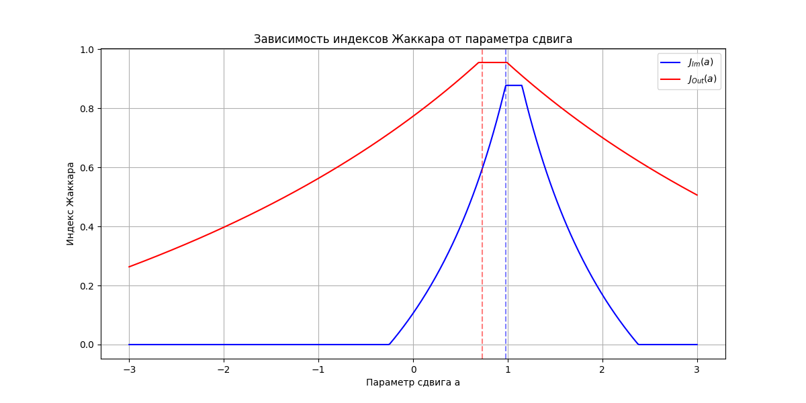

# Отчет по анализу сдвига распределений

## Исходные данные
- Выборка X₁: N(0, 0.95), n = 1000
- Выборка X₂: N(1, 1.05), n = 1000

## Результаты
### Границы распределений:
- Для X₁:
  - Внутренние: [-0.615, 0.616]
  - Внешние: [-3.079, 3.660]
- Для X₂:
  - Внутренние: [0.363, 1.765]
  - Внешние: [-2.087, 4.353]

### Оптимальные параметры сдвига:
- По внутренним оценкам: a_Im = 0.980
- По внешним оценкам: a_Out = 0.727

